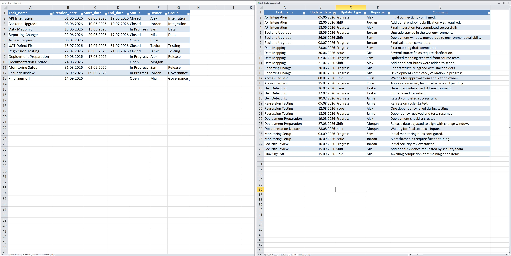
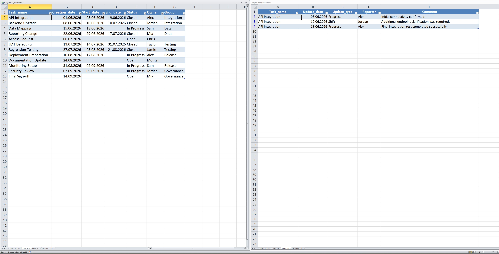
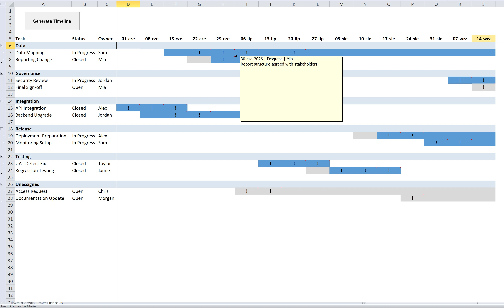

# Screenshots

The screenshots below use only fake/demo data and show the main workflow of the Task Timeline Tracker.

## TRACKER and UPDATES side by side

Recommended day-to-day workspace setup with the `TRACKER` and `UPDATES` sheets opened vertically next to each other.

## Automatic filtering of UPDATES

Selecting a task in `TRACKER` automatically filters the `UPDATES` table to show only entries related to that task. Clicking outside the task list removes the filter.

## Generated timeline with hover note

The generated weekly timeline shows grouped tasks, waiting and active periods, update markers, and detailed notes available on hover.

All screenshots are fully anonymized and use fictional data only.
